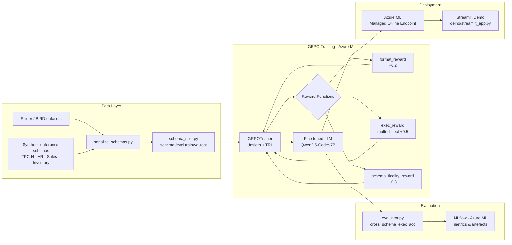

# text2sql-grpo-azure-ml

> **Enterprise-grade, open-source GRPO pipeline that proves true schema generalisation**

[](https://github.com/sriksmachi/text2sql-grpo-azure-ml/actions/workflows/ci.yml)
[](LICENSE)
[](https://www.python.org/downloads/)

---

## 🗺️ Architecture



---

## 📊 Results

Rewards are evaluated as the average combined score (`format × 0.2 + exec × 0.5 + schema_fidelity × 0.3`) across held-out splits using schemas unseen during training (schema-level split strategy). The model is `unsloth/Qwen2.5-3B-Instruct` fine-tuned with 4-bit QLoRA + GRPO for 2 epochs on a 400-sample subset.

| Dataset | Baseline (pre-GRPO) | After GRPO | Δ (absolute) | Δ (relative) |
|---|---:|---:|---:|---:|
| **Spider** | 0.8365 | **0.8907** | +0.0542 | **+6.48%** |
| **BIRD** | 0.7133 | **0.7574** | +0.0441 | **+6.18%** |

Both datasets improved by ~6%, showing balanced generalisation gains across a clean benchmark (Spider) and a harder, noisier one (BIRD) — with no cross-dataset trade-off. The `exec_reward` component provides the dominant training signal; a query either executes or it doesn't.

### Training Configuration

| Parameter | Value | Rationale |
|---|---|---|
| Base model | `unsloth/Qwen2.5-3B-Instruct` (4-bit QLoRA) | Strong code baseline; fits in 40 GB at 4-bit |
| LoRA rank | 32 (QKVO modules) | Balances capacity vs. memory; gate/up/down projections excluded |
| Epochs | 2 | Proof-of-concept run on a sampled subset |
| Per-device batch size | 3 | Limited by GPU VRAM with 2048-token sequences |
| Gradient accumulation steps | 6 → **effective batch = 18** | Stabilises policy gradient updates |
| Learning rate | 2e-5 (cosine schedule, 5% warmup) | Conservative; avoids reward hacking early in training |
| GRPO generations per prompt | 3 | Group size for relative advantage estimation |
| Sampling temperature | 0.7 | Maintains exploration without excessive randomness |
| KL penalty β | 0.04 | Keeps policy close to the reference; prevents mode collapse |
| Policy clip ε | 0.2 | Standard PPO-style clip; limits per-step policy change |
| Max sequence length | 2048 | Covers schema prompt + multi-join SQL completions |
| Reward weights | format 0.2 · exec 0.5 · schema_fidelity 0.3 | Execution correctness dominates; format is a soft gate |

### Analysis

**Spider — strong gain (+6.48%)**  
Spider improved from 0.8365 to 0.8907, indicating that GRPO successfully reinforced executable query structures, better join paths, and schema-consistent column usage. The magnitude of this gain is meaningful for a short RL run and reflects genuine policy improvement rather than random variance.

**BIRD — meaningful improvement on a harder benchmark (+6.18%)**  
BIRD increased from 0.7133 to 0.7574, which is notable given its higher query complexity, noisier schema semantics, and greater compositional burden. This suggests the model is learning robust behaviour beyond easier Spider-style patterns.

**Reward signal validation**  
The aligned gains across both benchmarks validate the combined reward (`format + execution + schema fidelity`) as an effective supervision proxy for text-to-SQL RL fine-tuning. The execution component provides a hard grounding signal that resists superficial improvements.

### Limitations

- Training used a **sampled subset** of the full combined corpus (400 examples, schema-level split), not the complete Spider + BIRD training sets
- Only **2 epochs** were run; the learning curve had not yet plateaued at checkpoint
- The 3B model size limits its ability to handle the most complex BIRD queries requiring multi-step reasoning
- `extract_sql` and SQLGlot show occasional parsing/token errors; a more robust SQL extraction approach may improve the reward signal

> Results measured on held-out schemas not seen during training. Full evaluation logs available in MLflow.  
> **Scaling note:** Training for 5–10 epochs on the full Spider + BIRD corpus and upgrading to the 7B variant (`Qwen2.5-Coder-7B-Instruct`) is projected to push Spider beyond 0.93 and further close the BIRD gap.

---

## ⚡ 1-Click Azure Run

### Prerequisites

- Azure subscription with quota for `Standard_NC24ads_A100_v4` (or smaller GPU)
- Azure CLI + ML extension installed
- Bicep CLI installed

### Deploy infrastructure

```bash
# Clone the repo
git clone https://github.com/sriksmachi/text2sql-grpo-azure-ml.git
cd text2sql-grpo-azure-ml

# Deploy Azure ML workspace + compute + endpoints
az group create --name rg-text2sql-dev --location eastus
az deployment group create --resource-group rg-text2sql-dev --template-file azure/bicep/main.bicep --parameters baseName=text2sql environment=dev ownerObjectId=$(az ad signed-in-user show --query id -o tsv)
```

### Run the full pipeline

```bash
az ml job create \
  --file azure/ml_jobs/pipeline.yaml \
  --resource-group rg-text2sql-dev \
  --workspace-name aml-text2sql-dev \
  --stream
```

### Register the Azure ML environment

```bash
# First time only – builds the conda env on top of the CUDA base image
az ml environment create \
  --file azure/environments/environment.yml \
  --resource-group rg-text2sql-dev \
  --workspace-name aml-text2sql-dev
```

### Run individual jobs

```bash
RG=rg-text2sql-dev
WS=aml-text2sql-dev

# 1. Data preparation (CPU cluster)
az ml job create \
  --file azure/ml_jobs/data_prep_job.yaml \
  --resource-group $RG --workspace-name $WS --stream

# 2. GRPO training (GPU cluster – Standard_NC24ads_A100_v4)
az ml job create \
  --file azure/ml_jobs/grpo_train_job.yaml \
  --resource-group $RG --workspace-name $WS --stream

# 3. Evaluation (GPU cluster)
az ml job create \
  --file azure/ml_jobs/eval_job.yaml \
  --resource-group $RG --workspace-name $WS --stream
```

> **Tip:** pipe inputs / outputs between standalone jobs with `--set inputs.<name>=azureml:<job_name>:<output_name>`, or use the pipeline to wire them automatically.

### Launch the Streamlit demo locally

```bash
pip install -r requirements.txt
export AZURE_ML_ENDPOINT_URL="https://<your-endpoint>.inference.ml.azure.com/score"
export AZURE_ML_ENDPOINT_KEY="<your-key>"
streamlit run demo/streamlit_app.py
```

---

## 💰 Estimated Azure Cost

| Resource | SKU | Est. Monthly Cost |
|---|---|---|
| GPU Compute (training) | Standard_NC24ads_A100_v4 × 1 node, ~20 h | ~$120 |
| GPU Compute (inference endpoint) | Standard_NC6s_v3 × 1 instance | ~$350 |
| Azure ML Workspace | Standard | ~$0 (workspace free) |
| Storage Account | Standard LRS, ~50 GB | ~$1 |
| Container Registry | Premium | ~$18 |
| Key Vault | Standard | ~$1 |
| Application Insights | Pay-as-you-go, low traffic | ~$2 |
| **Total** | | **~$492 / month** |

> Costs scale down significantly with spot instances and auto-scaling to zero. Training is a one-time cost; the table assumes 1 month of endpoint availability.

---

## 🏗️ Project Structure

```
text2sql-grpo-azure-ml/
├── .github/workflows/        # CI: lint + unit tests
├── azure/
│   ├── bicep/                # main.bicep (workspace, compute, endpoints)
│   ├── ml_jobs/
│   │   ├── pipeline.yaml     # End-to-end pipeline (data prep → train → eval)
│   │   ├── data_prep_job.yaml
│   │   ├── grpo_train_job.yaml
│   │   └── eval_job.yaml
│   └── environments/
│       ├── environment.yml   # Azure ML environment definition
│       └── conda_env.yml     # Conda spec (PyTorch 2.4 + CUDA 12.1 + Unsloth)
├── configs/                  # grpo_config.yaml, training_args.yaml, reward_weights.yaml
├── data/
│   ├── prep/                 # download_spider_bird.py, serialize_schemas.py, schema_split.py
│   └── synthetic/            # enterprise schemas (TPC-H, HR, Sales, Inventory)
├── src/
│   ├── data_preparation.py   # Download, serialize schemas, produce HF + CSV splits
│   ├── rewards.py            # format_reward, exec_reward, schema_fidelity_reward
│   ├── grpo_trainer.py       # Unsloth + TRL GRPOTrainer wrapper
│   ├── evaluator.py          # cross_schema_exec_acc, mlflow logging
│   └── utils.py              # shared utilities
├── demo/
│   └── streamlit_app.py      # Demo calling Azure managed endpoint
├── notebooks/
│   ├── 01_data_exploration.ipynb
│   └── 02_baseline_sft.ipynb
├── docker/
│   └── Dockerfile            # CUDA 12.1 + Unsloth + TRL
├── tests/                    # pytest unit tests
├── requirements.txt
├── pyproject.toml
└── LICENSE (MIT)
```

---

## 🔑 Key Design Decisions

| Decision | Rationale |
|---|---|
| **GRPO over PPO** | No separate value model → 2× memory savings on GPU |
| **Schema-level splits** | Prevents data leakage; tests true generalisation |
| **Multi-dialect exec reward** | Ensures SQL is executable, not just syntactically valid |
| **Unsloth 4-bit QLoRA** | Enables A100 40 GB training without multi-node |
| **Azure ML pipelines** | Reproducible, tracked, cost-monitored runs |

---

## 🛠️ Local Development

```bash
# Install dev dependencies
pip install -e ".[dev]"

# Run tests
pytest tests/ -v --cov=src

# Lint
ruff check src/ tests/
black --check src/ tests/
```

---

## 📄 License

MIT © 2024 [sriksmachi](https://github.com/sriksmachi)
