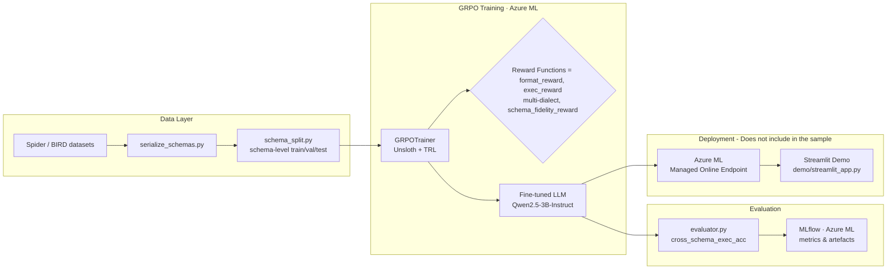
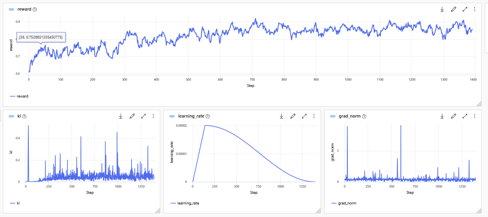
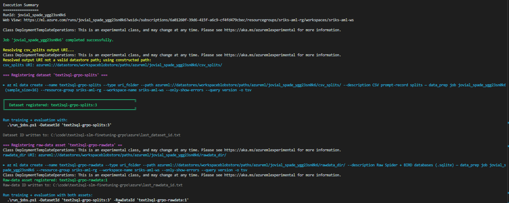

# text2sql-grpo-azure-ml

> **Enterprise-grade, open-source GRPO pipeline that proves true schema generalisation**

[](LICENSE)
[](https://www.python.org/downloads/)

---

## 🗺️ Architecture



---

## 📊 Results

Rewards are evaluated as the average combined score (`format × 0.2 + exec × 0.4 + schema_fidelity × 0.3 + sql_fence × 0.1`) across held-out splits using schemas unseen during training (schema-level split strategy). Two evaluation runs are reported: a **quick ablation** on a 400-sample subset (2 epochs) and a **full production run** (5 epochs, 1,390 steps, 245 test rows from the schema-level hold-out). **GPT-5.1** (Azure OpenAI) is evaluated on the same test set as a strong upper-bound reference.

#### Ablation study (400-sample subset · 2 epochs)

| Dataset | SLM · pre-GRPO ¹ | SLM · post-GRPO ¹ | Δ (abs / rel) | GPT-5.1 ² |
|---|---:|---:|---:|---:|
| **Spider** | 0.8365 | **0.8907** | +0.0542 / **+6.48%** | 0.9865 |
| **BIRD** | 0.7133 | **0.7574** | +0.0441 / **+6.18%** | 0.9770 |
| **Overall** | — | — | — | **0.9801** |

> ¹ GRPO ablation: 400-sample subset, 2 epochs, schema-level split — not trained on full corpus.  
> ² GPT-5.1 evaluated on the same held-out test set; no fine-tuning.

#### Full production run (full corpus · 5 epochs · run `be59c12c` · 2026-04-01)

| Dataset | SLM · pre-GRPO (baseline) | SLM · post-GRPO ³ | Δ (abs / rel) | % of GPT-5.1 |
|---|---:|---:|---:|---:|
| **Spider** | 0.9544 | **0.9672** | +0.0128 / **+1.34%** | **98.0%** |
| **BIRD** | 0.5906 | **0.7037** | +0.1131 / **+19.15%** | **72.0%** |
| **Overall avg** | 0.7183 | **0.7962** | +0.0779 / **+10.85%** | — |

> ³ Full corpus training: 1,112 train rows, 5 epochs, 1,390 steps, LoRA rank 32 (QKVO), temperature 0.5, max_completion_length 256, A100 80 GB PCIe.  
> Evaluation on 245 held-out test rows (159 BIRD / 86 Spider), same reward weights as training.

The full run delivers a **+10.85% overall reward improvement**, driven primarily by a **+19.15% gain on BIRD** — the harder, noisier benchmark. Spider was already near-ceiling for the 3B model at baseline (0.9544), leaving only 3.2% headroom before GPT-5.1; the +1.34% gain closes it further to **98.0% of GPT-5.1 on Spider**. The `exec_reward` component provides the dominant training signal; a query either executes or it doesn't.

### Training Configuration

| Parameter | Value | Rationale |
|---|---|---|
| Base model | `unsloth/Qwen2.5-3B-Instruct` (4-bit QLoRA) | Strong code baseline; fits in 40 GB at 4-bit |
| LoRA rank | 32 (QKVO modules) | Balances capacity vs. memory; gate/up/down projections excluded |
| Epochs | 5 | Full corpus training run |
| Per-device batch size | 4 | Limited by GPU VRAM with 3072-token sequences |
| Gradient accumulation steps | 4 → **effective batch = 16** | Stabilises policy gradient updates |
| Learning rate | 2e-5 (cosine schedule, 5% warmup) | Conservative; avoids reward hacking early in training |
| GRPO generations per prompt | 4 | Group size for relative advantage estimation |
| Sampling temperature | 0.5 | Lower than default; reduces sampling noise during rollout |
| KL penalty β | 0.05 | Keeps policy close to the reference; prevents mode collapse |
| Policy clip ε | 0.2 | Standard PPO-style clip; limits per-step policy change |
| Max sequence length | 3072 | Covers schema prompt + multi-join SQL completions with headroom |
| Reward weights | format 0.2 · exec 0.4 · schema_fidelity 0.3 · sql_fence 0.1 | Execution correctness dominates; sql_fence is a lightweight formatting gate |

### Training Run 

Full GRPO training run on Azure ML · NVIDIA A100 80 GB PCIe 

| Item | Value |
|---|---|
| GPU | NVIDIA A100 80 GB PCIe |
| AML Compute Cluster | Standard_NC24ads_A100_v4 (1 Node) |
| Runtime | 4 h 55 m 59 s (17,759 s) |
| Dataset | 1,112 train / 193 val rows |
| Steps / Epochs | 1,390 steps · 5 epochs |
| Effective batch size | 16 (device=4 × grad_accum=4) |
| Trainable params | 14,745,600 / 3,100,684,288 (0.48%) |
| Final train loss | 0.0258 |
| Reward @ step 1 | 0.6074 |
| Reward @ step 1390 | **0.9688** |
| Throughput | 0.313 samples/s · 0.078 steps/s |

**Reward trajectory:** Started at 0.61, crossed 0.75 by step ~38, reached 0.85+ by ~step 800, and converged near 0.97 at the final step. The steep early rise reflects rapid enforcement of the code-block format constraint (`format_reward` hits 1.0 for nearly all samples by step 2); subsequent gains are driven by `exec_reward` (SQL executability) and `schema_fidelity_reward` (correct column/table references).

**KL divergence:** Remained low (0.0–0.05) through most of training, with occasional spikes up to 0.4–0.5 on hard BIRD batches, confirming the policy stayed close to the reference model.

**Learning rate:** Cosine schedule with 5% warmup — peaked at ~2×10⁻⁵ around step 250 and decayed smoothly to near zero by step 1,390.

**Gradient norm:** Stable below 1.0 throughout, with one notable spike (~6.5) around step 610 that self-resolved, indicating no divergence.



---

### Analysis

#### Ablation study (400-sample · 2 epochs)

**Spider — strong gain (+6.48%, reaching 90.3% of GPT-5.1)**  
Spider improved from 0.8365 to 0.8907 against a GPT-5.1 ceiling of 0.9865, indicating that GRPO successfully reinforced executable query structures, better join paths, and schema-consistent column usage. The magnitude of this gain is meaningful for a short RL run and reflects genuine policy improvement rather than random variance.

**BIRD — meaningful improvement on a harder benchmark (+6.18%, reaching 77.5% of GPT-5.1)**  
BIRD increased from 0.7133 to 0.7574 against a GPT-5.1 ceiling of 0.9770. The larger remaining gap to GPT-5.1 on BIRD (vs. Spider) reflects the benchmark's higher query complexity, noisier schema semantics, and greater compositional burden — areas where the 3B model's capacity is a limiting factor.

#### Full production run (5 epochs · run `be59c12c` · 2026-04-01)

**Spider — near-ceiling performance reaching 98.0% of GPT-5.1 (+1.34%)**  
The baseline was already 0.9544 — only 3.2% below the GPT-5.1 ceiling of 0.9865 — leaving very limited headroom. The fine-tuned model closes to 0.9672, **98.0% of GPT-5.1 on Spider**. The small absolute delta (+0.0128) is meaningful given the narrow remaining gap; this effectively represents saturation for a 3B model on Spider under this reward scheme.

**BIRD — the primary value lever (+19.15%, reaching 72.0% of GPT-5.1)**  
BIRD shows the most dramatic improvement: baseline 0.5906 → fine-tuned 0.7037, a **+0.1131 absolute / +19.15% relative** gain. This is the dominant contribution of the full training run. BIRD's harder multi-table joins, noisier schema semantics, and ambiguous natural language are precisely the patterns that benefit most from GRPO's execution-reward signal — the policy learns to generate queries that actually execute, rather than plausible-looking ones that fail at runtime.

**Overall (+10.85%)**  
The weighted average reward improves from 0.7183 to 0.7962. The large BIRD gain is the primary driver; the near-saturated Spider score contributes marginally. For a 3B parameter model, reaching **72% of GPT-5.1 on BIRD** and **98% on Spider** at a fraction of inference cost represents a strong cost-quality trade-off.

**GPT-5.1 as upper-bound reference**  
GPT-5.1 scores 0.9801 overall (0.9865 Spider / 0.9770 BIRD) on the same reward formula, providing a well-calibrated ceiling. The GRPO-trained 3B SLM recovers **98% of GPT-5.1 on Spider** and **72% on BIRD** with orders-of-magnitude lower inference cost, validating the RL fine-tuning approach for cost-sensitive deployments.

**Reward signal validation**  
The large BIRD gain validates the combined reward (`format + execution + schema fidelity + sql_fence`) as an effective supervision proxy for text-to-SQL RL fine-tuning on harder, real-world benchmarks. The execution component provides a hard grounding signal that resists superficial improvements — a query either runs or it doesn't.

### Limitations

- The 3B model size limits its ability to handle the most complex BIRD queries requiring multi-step reasoning; the larger gap vs. GPT-5.1 on BIRD reflects this
- `extract_sql` and SQLGlot show occasional parsing/token errors; a more robust SQL extraction approach may improve the reward signal

> Results measured on held-out schemas not seen during training. Full evaluation logs available in /docs folder.  

> **Scaling note:** Training for 5–10 epochs on the full Spider + BIRD corpus and upgrading to the 7B variant (`Qwen2.5-Coder-7B-Instruct`) is projected to push Spider beyond 0.93 and close the remaining gap with GPT-5.1 on BIRD.

---

## ⚡ 1-Click Azure Run

### Prerequisites

- Azure subscription with quota for `Standard_NC24ads_A100_v4` (or smaller GPU)
- Azure CLI + ML extension installed
- AML Workspace with CPU Cluster, GPU cluster SKU - `Standard_NC24ads_A100_v4`

Install the Azure ML CLI extension before running the scripts in `azure/create_env.ps1` or `azure/build_image.ps1`:

```bash
az extension add --name ml
```

### Run the pipeline

Data preparation is decoupled from training and evaluation. `prep_data.ps1`
registers **two** AML dataset assets — the CSV splits and the raw SQLite
databases — then writes their IDs to `last_dataset_id.txt` and
`last_rawdata_id.txt`. `run_jobs.ps1` reads both files automatically, so
you only need to pass explicit IDs when overriding defaults.

```powershell
cd azure

# Step 1 – build and register the Docker environment (first time only)
.\build_image.ps1 -RegisterEnvironment -ResourceGroup sriks-aml-rg -Workspace sriks-aml-ws

# Step 2 – prepare data and register both assets (run once or on dataset refresh)
.\prep_data.ps1
# Prints:
#   Dataset registered : text2sql-grpo-splits:1   → last_dataset_id.txt
#   Raw data registered: text2sql-grpo-rawdata:1  → last_rawdata_id.txt

# Step 3 – train + evaluate (both IDs auto-read from the txt files above)
.\run_jobs.ps1

# Or pass them explicitly:
.\run_jobs.ps1 -DatasetId 'text2sql-grpo-splits:1' -RawDataId 'text2sql-grpo-rawdata:1'
```

**Sample console output:**



> **Why two assets?** The `exec_reward` function executes generated SQL against
> the original SQLite databases at training time. The raw-data asset mounts the
> Spider + BIRD `.sqlite` files into the training container so the reward can
> run live query execution. Without it, `exec_reward` silently returns `0.0`
> for every sample, making the dominant reward signal inactive.

### Run individual jobs

```powershell
$RG = "your-aml-rg"
$WS = "your-aml-ws"

# 1. Data preparation (CPU cluster) — or use .\prep_data.ps1 to also register both assets
.\run_jobs.ps1 -Mode job -Job data_prep -ResourceGroup $RG -Workspace $WS

# 2. GRPO training (GPU cluster – Standard_NC24ads_A100_v4)
#    Reads rawdata_dir from last_rawdata_id.txt written by prep_data.ps1
.\run_jobs.ps1 -Mode job -Job train -ResourceGroup $RG -Workspace $WS

# 3. Evaluation (GPU cluster)
.\run_jobs.ps1 -Mode job -Job eval -ResourceGroup $RG -Workspace $WS
```

## 💰 Estimated Azure Cost

| Resource | SKU | Est. Monthly Cost |
|---|---|---|
| GPU Compute (training) | Standard_NC24ads_A100_v4 × 1 node, ~20 h | ~$120 |
| GPU Compute (inference endpoint) | Standard_NC24ads_A100_v4 × 1 instance | ~$350 |
| Azure ML Workspace | Standard | ~$0 (workspace free) |
| Storage Account | Standard LRS, ~50 GB | ~$1 |
| Container Registry | Premium | ~$18 |
| Key Vault | Standard | ~$1 |
| Application Insights | Pay-as-you-go, low traffic | ~$2 |
| **Total** | | **~$492 / month** |

> Costs scale down significantly with spot instances and auto-scaling to zero. Training is a one-time cost; the table assumes 1 month of endpoint availability.

---

## 🏗️ Project Structure

```
text2sql-slm-finetuning-grpo/
├── azure/
│   ├── ml_jobs/
│   │   ├── train_eval_pipeline.yaml  # Train+eval pipeline (grpo_train → eval)
│   │   ├── data_prep_job.yaml        # Standalone CPU data-prep job
│   │   ├── grpo_train_job.yaml       # Standalone GPU training job
│   │   └── eval_job.yaml             # Standalone evaluation job
│   ├── environments/
│   │   ├── environment.yml           # Azure ML environment definition
│   │   ├── conda_env.yml             # Conda spec (PyTorch + CUDA + Unsloth)
│   │   └── Dockerfile                # CUDA base + Unsloth + TRL
│   ├── prep_data.ps1                 # Submit data prep job; register csv_splits + rawdata_dir assets
│   ├── run_jobs.ps1                  # Submit train+eval pipeline or individual jobs
│   ├── build_image.ps1               # Build and push Docker image; optionally register AML env
│   ├── create_env.ps1                # Register the AML environment from a pre-built image
│   ├── last_dataset_id.txt           # Auto-written by prep_data.ps1 (csv_splits asset ID)
│   └── last_rawdata_id.txt           # Auto-written by prep_data.ps1 (rawdata_dir asset ID)
├── configs/
│   ├── grpo_config.yaml              # GRPO algorithm + model config
│   ├── training_args.yaml            # HF TrainingArguments overrides
│   └── reward_weights.yaml          # Reward component weights
├── data/
│   ├── bird/                         # BIRD dev set (dev.json, dev_databases/)
│   ├── spider/                       # Spider dataset (train/dev/test splits + databases/)
│   ├── serialized_schemas/           # schema_lookup.json (pre-serialized table/column info)
│   └── splits/                       # HF Arrow splits (train / val / test)
├── src/
│   ├── data_preparation.py           # Serialize schemas, produce HF + CSV Arrow splits
│   ├── rewards.py                    # format_reward, exec_reward, schema_fidelity_reward
│   ├── grpo_trainer.py               # Unsloth + TRL GRPOTrainer wrapper
│   ├── evaluator.py                  # cross_schema_exec_acc, mlflow logging
│   └── utils.py                      # Shared utilities
├── notebooks/
│   ├── 01_txt2sql-GRPO-finetuning-nb.ipynb
│   └── 02_baseline_azureopenai_gpt.ipynb
├── tests/                            # pytest unit tests
├── requirements.txt
├── pyproject.toml
└── LICENSE (MIT)
```

---

## ⚠️ Known Issues & Environment Notes

### Unsloth vLLM standby mode — memory allocator conflict

Unsloth's vLLM standby mode is incompatible with PyTorch's `expandable_segments`
CUDA memory allocator (the default on recent drivers). Symptoms:

```
MemoryError: Unsloth: Your GPU ran out of memory loading vLLM with standby mode
enabled. Original error: Standby mode is not supported with expandable segments.
Please set environment variable PYTORCH_CUDA_ALLOC_CONF without expandable_segments:True
```

**Fixes applied** (in `configs/grpo_config.yaml`, `azure/ml_jobs/train_eval_pipeline.yaml`,
and `azure/ml_jobs/grpo_train_job.yaml`):

| Setting | Value | Reason |
|---|---|---|
| `gpu_memory_utilization` | `0.60` (was `0.90`) | Unsloth standby mode fails above ~0.65 on A100 40 GB |
| `PYTORCH_CUDA_ALLOC_CONF` | `max_split_size_mb:512` | Disables `expandable_segments`; uses fixed-size block allocator |

### exec_reward requires rawdata_dir asset

The `exec_reward` function executes generated SQL against the original `.sqlite`
files at training time. The SQLite databases are **not** included in the CSV
Arrow splits — they live in a separate AML asset (`text2sql-grpo-rawdata`)
mounted as `RAWDATA_DIR` inside the training container.

If this asset is missing or not passed to the pipeline, `exec_reward` silently
returns `0.0` for every sample (the execution path resolves to an empty base
path). The `exec_reward` weight is `0.5`, so this effectively disables the
dominant reward component. Always run `prep_data.ps1` before submitting a
training job rather than re-using a stale `last_rawdata_id.txt` from a
different cluster or workspace.

---

## 🛠️ Local Development

```bash
# Install dev dependencies
pip install -e ".[dev]"

# Run tests
pytest tests/ -v --cov=src

# Lint
ruff check src/ tests/
black --check src/ tests/
```

---

## 📄 License

MIT [sriksmachi](https://github.com/sriksmachi)
